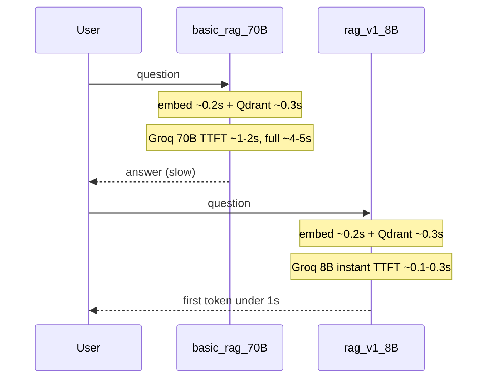

# Fix basic-rag-chatbot-v1 Speed and Folder Structure

## Root Cause Analysis

Even with "the same Groq provider," the two projects are **not** running the same stack. The latency gap is expected from the code defaults:

| Factor | basic-rag-chatbot-v1 (slow) | RAG_Chatbot_v1 (fast) | Impact |
|--------|------------------------------|------------------------|--------|
| **Groq model** | `llama-3.3-70b-versatile` ([config.py](c:/Users/yudhi/OneDrive/Desktop/techahead/basic-rag-chatbot-v1/app/core/config.py)) | `llama-3.1-8b-instant` ([groq.py](c:/Users/yudhi/OneDrive/Desktop/techahead/RAG_Chatbot_v1/app/services/llm/groq.py)) | **Primary cause** — 70B is ~3–5× slower than 8B instant on Groq |
| **LLM SDK** | LangChain `ChatGroq` wrapper ([model_factory.py](c:/Users/yudhi/OneDrive/Desktop/techahead/basic-rag-chatbot-v1/app/llm/model_factory.py)) | Direct `groq` SDK ([groq.py](c:/Users/yudhi/OneDrive/Desktop/techahead/RAG_Chatbot_v1/app/services/llm/groq.py)) | Minor overhead (~50–150ms) |
| **Embedding default** | `models/text-embedding-004` (Google, 768-dim) in config but code hardcodes **384-dim** SentenceTransformer | `all-MiniLM-L6-v2` consistently | Config bug — can cause wrong model load or bad retrieval |
| **Startup warmup** | Embeddings + Qdrant only ([main.py](c:/Users/yudhi/OneDrive/Desktop/techahead/basic-rag-chatbot-v1/main.py)) | Module-level singletons at import | First Groq call pays cold-start cost in basic |
| **Retrieval path** | Already optimized (direct ST + `query_points`) | Same pattern | ~0.2–0.8s — **not** the main gap |



### How to verify before changing code

The project already prints `[TIMING]` logs in [pipeline.py](c:/Users/yudhi/OneDrive/Desktop/techahead/basic-rag-chatbot-v1/app/rag/pipeline.py) and [qdrant_store.py](c:/Users/yudhi/OneDrive/Desktop/techahead/basic-rag-chatbot-v1/app/vectorstore/qdrant_store.py). Run one query and check:

- If **Step 3 - LLM generation** is ~3–4s → model size is the bottleneck (expected with 70B)
- If **embed query** is >1s on 2nd+ query → embedding model misconfigured in `.env`
- Check server startup logs for `[LLM] Initializing Groq (llama-3.3-70b-versatile)` vs desired model

Also compare `.env` values side-by-side: `GROQ_MODEL`, `EMBEDDING_MODEL`, `LLM_PROVIDER`.

---

## Performance Fixes (target: sub-1s time-to-first-token)

### 1. Switch Groq to `llama-3.1-8b-instant` (your choice)

- Change default in [config.py](c:/Users/yudhi/OneDrive/Desktop/techahead/basic-rag-chatbot-v1/app/core/config.py): `groq_model = "llama-3.1-8b-instant"`
- Document in [.env.example](c:/Users/yudhi/OneDrive/Desktop/techahead/basic-rag-chatbot-v1/.env.example) with `GROQ_API_KEY`, `GROQ_MODEL`, and `LLM_PROVIDER=groq`

### 2. Replace LangChain Groq with direct SDK (match RAG_Chatbot_v1)

During restructure, add `app/services/llm/groq.py` using native `groq.Groq` with `stream=True` — same pattern as RAG_Chatbot_v1. Keep LangChain only for Google/Ollama if needed, or migrate all providers to the factory pattern in v1.

Benefits: less abstraction, native streaming, consistent with the fast project.

### 3. Fix embedding config end-to-end

- Set default `embedding_model = "all-MiniLM-L6-v2"` in config
- Update `.env.example`, [ingest.py](c:/Users/yudhi/OneDrive/Desktop/techahead/basic-rag-chatbot-v1/ingest.py) comments, and [routes.py](c:/Users/yudhi/OneDrive/Desktop/techahead/basic-rag-chatbot-v1/app/api/routes.py) docstrings (currently say "Google embeddings")
- Unify ingest + query to use the same `_embedder` singleton (like [vector_store.py](c:/Users/yudhi/OneDrive/Desktop/techahead/RAG_Chatbot_v1/app/db/vector_store.py)) — remove duplicate LangChain `HuggingFaceEmbeddings` path during restructure
- Replace `force_recreate=True` in ingest with `ensure_collection` + upsert (v1 pattern) so re-ingest doesn't wipe the collection every time

### 4. Extend startup warmup

In [main.py](c:/Users/yudhi/OneDrive/Desktop/techahead/basic-rag-chatbot-v1/main.py) startup, also warm the active LLM provider:

```python
await asyncio.to_thread(get_llm, settings.llm_provider)
```

### 5. Fix `/health` to report actual Groq model

Currently [routes.py](c:/Users/yudhi/OneDrive/Desktop/techahead/basic-rag-chatbot-v1/app/api/routes.py) only handles google/ollama — Groq shows wrong model name. Use a small helper that maps provider → model from settings.

### 6. Optional quick wins (low effort)

- Run retrieval in `asyncio.to_thread` inside streaming route so embed+Qdrant don't block the event loop
- Reduce debug `print()` noise in hot path (600-space separator in `/chat`) — use logger at INFO instead
- Keep `/chat/stream` as the default UI path (already used by [static/chat.html](c:/Users/yudhi/OneDrive/Desktop/techahead/basic-rag-chatbot-v1/static/chat.html))

---

## Folder Restructure (align with RAG_Chatbot_v1)

### Target layout

```
basic-rag-chatbot-v1/
├── main.py                    # FastAPI entry (minimal)
├── cli.py                     # merge chat.py + ingest.py interactive flows
├── ingest.py                  # thin CLI wrapper → services (optional keep)
├── requirements.txt or pyproject.toml
├── .env.example
├── README.md                  # fill in (currently empty)
├── static/                    # or frontend/ later
│   └── chat.html
├── docs/                      # source documents
└── app/
    ├── api/
    │   └── router.py          # rename from routes.py
    ├── core/
    │   ├── config.py
    │   ├── prompt.py          # extract SYSTEM_PROMPT from pipeline
    │   └── logging.py         # rename from logger.py
    ├── db/
    │   └── vector_store.py    # move from vectorstore/qdrant_store.py
    └── services/
        ├── rag_service.py     # move from rag/pipeline.py
        ├── ingestion.py       # merge loader.py + chunker.py logic
        └── llm/
            ├── base.py
            ├── factory.py
            ├── groq.py        # direct SDK, 8b-instant
            ├── gemini.py      # optional: migrate from LangChain
            └── ollama.py
```

### Files to remove or relocate

| Current | Action |
|---------|--------|
| [chat.html](c:/Users/yudhi/OneDrive/Desktop/techahead/basic-rag-chatbot-v1/chat.html) (root duplicate) | Delete — keep `static/chat.html` only |
| [agent.py](c:/Users/yudhi/OneDrive/Desktop/techahead/basic-rag-chatbot-v1/agent.py) | Move to `examples/agent_demo.py` or delete (unrelated weather demo) |
| `app/rag/`, `app/vectorstore/`, `app/llm/`, `app/ingestion/` | Remove after migration to `app/services/` and `app/db/` |
| [chat.py](c:/Users/yudhi/OneDrive/Desktop/techahead/basic-rag-chatbot-v1/chat.py) | Fold into `cli.py` |

### Import migration map

```
app.rag.pipeline          → app.services.rag_service
app.vectorstore.qdrant_store → app.db.vector_store
app.llm.model_factory     → app.services.llm.factory
app.ingestion.loader/chunker → app.services.ingestion
app.core.logger           → app.core.logging
app.api.routes            → app.api.router
```

Update all imports in [main.py](c:/Users/yudhi/OneDrive/Desktop/techahead/basic-rag-chatbot-v1/main.py), CLI scripts, and tests.

---

## Implementation Order

1. **Benchmark baseline** — run one query, capture `[TIMING]` breakdown and note active Groq model from logs
2. **Quick config fix** — Groq model + embedding default + `.env.example` (immediate speed win without restructure)
3. **Restructure folders** — move files, update imports, extract prompt + LLM providers
4. **Unify vector store** — single embedder, upsert-based ingest, no `force_recreate`
5. **Warmup + health fix** — verify sub-1s first token
6. **Cleanup** — remove duplicates, update README/COMMANDS.md

---

## Expected Outcome

After changes, basic-rag-chatbot-v1 should match RAG_Chatbot_v1 latency profile:

- Retrieval: ~0.2–0.5s (embed + Qdrant)
- First token (Groq 8B instant): ~0.1–0.5s after retrieval
- Full answer: ~1–2s total (vs current 4–5s with 70B)

Folder structure will mirror the production-ready v1 layout, making both projects easier to maintain side-by-side.
